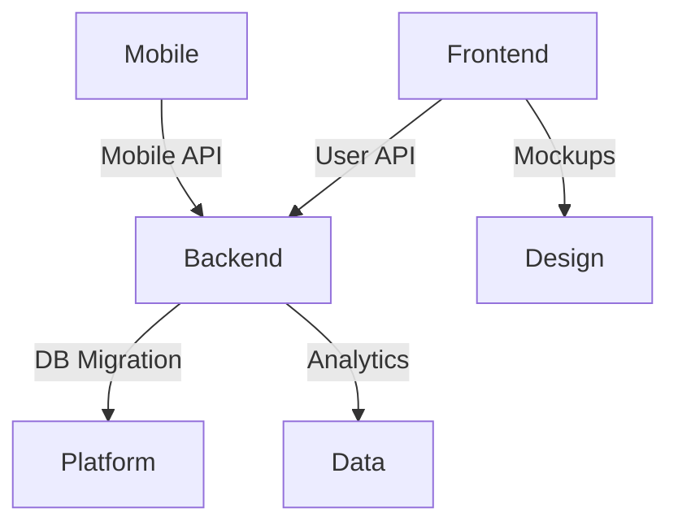

# Dependency Map Command

## Purpose
Visualizes and analyzes dependencies between teams, services, and features to identify risks, bottlenecks, and coordination needs.

## Usage
```
/dependency-map [--scope=team|service|feature] [--format=text|mermaid|json]
```

## Parameters
- `--scope`: Dependency level
  - `team`: Inter-team dependencies (default)
  - `service`: Service architecture dependencies
  - `feature`: Feature-level dependencies
- `--format`: Output visualization
  - `text`: Text-based diagram
  - `mermaid`: Mermaid diagram code
  - `json`: Structured data
- `--highlight-risks`: Show only risky dependencies
- `--critical-path`: Identify critical path

## Execution Flow

### 1. Dependency Discovery
**Delegates to:** team-coordinator subagent

Scan for dependencies:
- Code imports and references
- API calls and integrations
- Database relationships
- Infrastructure dependencies
- Team commitments

### 2. Classification
Categorize dependencies:
- **Type**: Service, data, team, external
- **Strength**: Strong, weak, optional
- **Direction**: Unidirectional, bidirectional
- **Status**: Active, planned, deprecated

### 3. Risk Assessment
Evaluate each dependency:
- **Criticality**: Impact if unavailable
- **Stability**: Reliability and maturity
- **Coupling**: Tight vs. loose coupling
- **Ownership**: Clear vs. unclear

### 4. Path Analysis
Identify:
- Critical paths
- Bottlenecks
- Circular dependencies
- Single points of failure

### 5. Generate Map

```
DEPENDENCY MAP
==============
Scope: Team Dependencies
Project: Q4 2025 Roadmap

TEAM DEPENDENCY GRAPH
---------------------

Frontend Team
    ├─→ Backend API Team
    │   ├─ User Service API v2 (HIGH RISK)
    │   │  Status: IN_DEVELOPMENT
    │   │  Due: Oct 15
    │   │  Risk: Not yet started
    │   │
    │   ├─ Dashboard API (MEDIUM)
    │   │  Status: IN_PROGRESS
    │   │  Due: Oct 30
    │   │  Risk: Scope unclear
    │   │
    │   └─ Analytics API (LOW)
    │      Status: AVAILABLE
    │
    ├─→ Design Team
    │   └─ Dashboard Mockups (COMPLETED)
    │
    └─→ Platform Team
        └─ CDN Configuration (BLOCKED)
           Status: PENDING_APPROVAL
           Blocker: Security review

Backend API Team
    ├─→ Platform Team
    │   ├─ Database Migration (CRITICAL)
    │   │  Status: IN_PROGRESS
    │   │  Due: Oct 10
    │   │  Risk: Deadline tight
    │   │
    │   └─ Cache Infrastructure (MEDIUM)
    │      Status: READY
    │
    ├─→ Data Team
    │   └─ Analytics Pipeline (HIGH)
    │      Status: BLOCKED
    │      Blocker: Data schema not finalized
    │
    └─→ Mobile Team
        └─ API Contract (MEDIUM)
           Status: NEGOTIATING
           Risk: Breaking changes

Mobile Team
    ├─→ Backend API Team
    │   ├─ Mobile API v3 (HIGH)
    │   │  Status: PLANNING
    │   │  Due: Nov 1
    │   │
    │   └─ Push Notifications (MEDIUM)
    │      Status: IN_PROGRESS
    │
    └─→ Platform Team
        └─ Mobile Build Pipeline (LOW)
           Status: READY

Platform Team
    └─→ Infrastructure (External)
        ├─ AWS Region Migration (CRITICAL)
        │  Status: SCHEDULED
        │  Due: Oct 20
        │  Risk: Customer impact
        │
        └─ Kubernetes Upgrade (MEDIUM)
           Status: TESTING

DEPENDENCY MATRIX
-----------------
               Frontend  Backend  Mobile  Platform  Data
Frontend          -        3       0        1       0
Backend           0        -       1        2       1
Mobile            0        2       -        1       0
Platform          1        1       1        -       0
Data              0        1       0        0       -

Total: 14 dependencies

RISK ANALYSIS
-------------

🔴 CRITICAL RISKS (Immediate Attention):

1. User Service API v2 (Frontend ← Backend)
   Status: IN_DEVELOPMENT
   Due: Oct 15 (11 days)
   Problem: Not yet started, blocks frontend work
   Impact: Dashboard launch delayed 2+ weeks
   Mitigation: Start immediately, daily standups

2. Database Migration (Backend ← Platform)
   Status: IN_PROGRESS
   Due: Oct 10 (6 days)
   Problem: Tight deadline, complex migration
   Impact: Backend features delayed
   Mitigation: Add resources, extend deadline

3. AWS Region Migration (Platform ← External)
   Due: Oct 20
   Problem: Customer-facing, risky
   Impact: Potential downtime
   Mitigation: Extensive testing, rollback plan

🟡 HIGH RISKS (Monitor Closely):

1. Analytics Pipeline (Backend ← Data)
   Status: BLOCKED
   Blocker: Data schema not finalized
   Impact: Analytics features delayed
   Mitigation: Escalate schema decision

2. Mobile API v3 (Mobile ← Backend)
   Status: PLANNING
   Due: Nov 1
   Impact: Mobile app launch
   Mitigation: Prioritize planning, lock scope

BLOCKERS
--------

Active Blockers: 2

1. Analytics Pipeline
   Waiting On: Data team schema finalization
   Blocking: Backend API analytics endpoints
   Duration: 5 days
   Action: Schedule decision meeting

2. CDN Configuration
   Waiting On: Security review approval
   Blocking: Frontend deployment
   Duration: 3 days
   Action: Escalate to security lead

CIRCULAR DEPENDENCIES
---------------------

None detected ✅

CRITICAL PATH
-------------

Longest dependency chain to Q4 goals:

Frontend Dashboard Launch:
  Platform (DB Migration, 6d)
    → Backend (User API, 15d)
      → Frontend (Dashboard UI, 20d)
        → LAUNCH (Oct 30)

Total Critical Path: 41 days
Current Date: Oct 4
Remaining: 26 days
Buffer: -15 days (AT RISK ⚠️)

BOTTLENECK ANALYSIS
-------------------

Most Depended Upon:
1. Backend API Team: 6 dependencies
   Risk: Overloaded, potential delays
   Recommendation: Add capacity or descope

2. Platform Team: 4 dependencies
   Risk: Infrastructure changes risky
   Recommendation: Strict change management

Least Redundancy:
1. User Service API: Single implementation
   Risk: No fallback option
   Recommendation: Build graceful degradation

DEPENDENCY HEALTH
-----------------

By Status:
  ✅ Ready/Completed:  5 (36%)
  🔄 In Progress:      6 (43%)
  📋 Planning:         2 (14%)
  🔴 Blocked:          2 (14%)

By Risk:
  🔴 Critical:  3 (21%)
  🟡 High:      5 (36%)
  🟢 Medium:    4 (29%)
  🟢 Low:       2 (14%)

Overall Health: ⚠️  NEEDS ATTENTION

RECOMMENDATIONS
---------------

🎯 IMMEDIATE ACTIONS:

1. Unblock Analytics Pipeline
   - Schedule schema decision meeting today
   - Set deadline: Oct 5
   - Owner: Data team lead

2. Accelerate User Service API
   - Reprioritize to P0
   - Add 2nd developer
   - Daily check-ins with frontend team

3. Add Buffer to Database Migration
   - Extend deadline to Oct 12
   - Add migration testing day
   - Prepare rollback plan

🎯 PROCESS IMPROVEMENTS:

1. Weekly Dependency Review
   - All teams attend
   - Review blockers and status
   - Escalate risks early

2. Dependency Registry
   - Document all cross-team dependencies
   - Track in shared tool (Jira/Notion)
   - Update in sprint planning

3. API Contract Process
   - Define contracts early
   - Review and lock before development
   - Version and document changes

🎯 ARCHITECTURAL:

1. Reduce Backend API Coupling
   - Most depended-upon service
   - Consider API gateway pattern
   - Build redundancy

2. Implement Circuit Breakers
   - Graceful degradation
   - Reduce dependency failures
   - Improve resilience

SERVICE DEPENDENCY MAP
----------------------
(If --scope=service):

User Service
    ├─→ Auth Service
    ├─→ Notification Service
    └─→ User Database

Dashboard Service
    ├─→ User Service
    ├─→ Analytics Service
    ├─→ Cache Layer
    └─→ Dashboard Database

Analytics Service
    ├─→ Data Pipeline
    ├─→ Analytics Database
    └─→ External Analytics API

INTEGRATION POINTS
------------------

Critical Integrations:
1. Frontend ↔ Backend: REST APIs
   - 15 endpoints
   - Authentication: OAuth2
   - Rate limiting: 1000 req/min

2. Backend ↔ Database: PostgreSQL
   - Connection pooling: 100 max
   - Replication: Primary + 2 replicas
   - Backup: Daily

3. Mobile ↔ Backend: GraphQL
   - Real-time: WebSockets
   - Offline sync: Service workers

EXTERNAL DEPENDENCIES
---------------------

Third-Party Services:
1. AWS (CRITICAL)
   - Uptime: 99.99% SLA
   - Region: us-east-1
   - Backup: Multi-region

2. Stripe Payment (CRITICAL)
   - Uptime: 99.9% SLA
   - Fallback: Queue for retry

3. SendGrid Email (MEDIUM)
   - Uptime: 99.5% SLA
   - Fallback: Amazon SES

4. Google Analytics (LOW)
   - Uptime: Variable
   - Fallback: Not critical
```

## Visualization Formats

### Text Diagram
ASCII-art tree structure (shown above)

### Mermaid Diagram


### JSON Structure
```json
{
  "dependencies": [
    {
      "from": "Frontend",
      "to": "Backend",
      "item": "User Service API",
      "risk": "HIGH",
      "status": "IN_DEVELOPMENT"
    }
  ]
}
```

## Examples

### Team Dependencies
```
/dependency-map --scope=team

TEAM DEPENDENCY MAP
-------------------
Frontend → Backend: 3 dependencies
Backend → Platform: 2 dependencies
Mobile → Backend: 2 dependencies

Blockers: 2
Critical Path: 41 days
```

### Service Architecture
```
/dependency-map --scope=service --format=mermaid

Generated Mermaid diagram:
[Shows service-to-service dependencies]

Copy to visualize at mermaid.live
```

### Risk Highlights
```
/dependency-map --highlight-risks

RISKY DEPENDENCIES
------------------
🔴 User Service API (Frontend ← Backend)
🔴 Database Migration (Backend ← Platform)
🟡 Analytics Pipeline (Backend ← Data)

3 high-risk dependencies found
```

### Critical Path
```
/dependency-map --critical-path

CRITICAL PATH TO LAUNCH
-----------------------
Platform DB → Backend API → Frontend UI
Total: 41 days
Deadline: 26 days remaining
Status: ⚠️  AT RISK
```

## Best Practices

1. **Map Early**: Identify dependencies in planning
2. **Update Regularly**: Keep map current
3. **Communicate**: Share with all stakeholders
4. **Monitor Risks**: Track high-risk dependencies
5. **Break Cycles**: Eliminate circular dependencies
6. **Plan Buffers**: Add time for dependency delays
7. **Build Resilience**: Reduce critical dependencies
