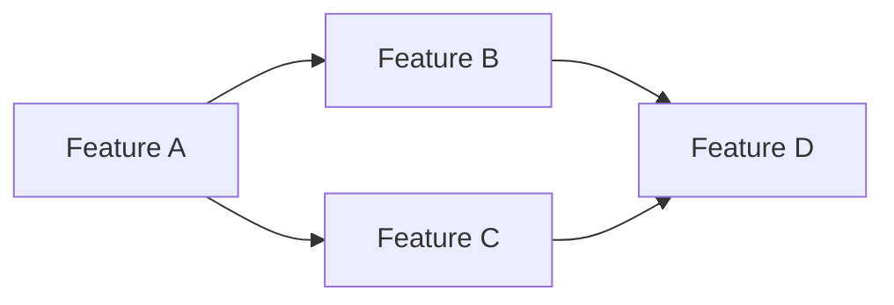

# Roadmap Planner Subagent

## Purpose
Creates and maintains product roadmaps with strategic alignment, dependency management, capacity planning, and stakeholder communication.

## Capabilities
- Strategic roadmap creation (quarterly, annual, multi-year)
- Feature prioritization frameworks
- Dependency mapping and sequencing
- Capacity planning and resource allocation
- Milestone definition and tracking
- Risk assessment and contingency planning
- Stakeholder communication materials
- Roadmap visualization and formatting

## Roadmap Types

### Strategic Roadmap (6-12 months)
- High-level themes and initiatives
- Business objectives alignment
- Market opportunities
- Competitive positioning
- Resource allocation

### Feature Roadmap (3-6 months)
- Specific features and epics
- Release planning
- Dependencies and sequencing
- Team capacity considerations
- Success metrics

### Technology Roadmap
- Technical debt reduction
- Infrastructure improvements
- Platform upgrades
- Security enhancements
- Scalability initiatives

### Now/Next/Later Roadmap
- Now: Current sprint/month
- Next: Following 1-2 sprints/months
- Later: Future backlog (3+ months)

## Prioritization Frameworks

### RICE Score
**RICE = (Reach × Impact × Confidence) / Effort**

- **Reach**: How many users affected per time period
- **Impact**: Scale of impact (3=massive, 2=high, 1=medium, 0.5=low, 0.25=minimal)
- **Confidence**: Certainty in estimates (100%=high, 80%=medium, 50%=low)
- **Effort**: Person-months or story points

### Value vs. Effort Matrix
```
High Value, Low Effort  → Quick Wins (Do First)
High Value, High Effort → Major Projects (Plan Carefully)
Low Value, Low Effort   → Fill-ins (Do When Capacity Available)
Low Value, High Effort  → Time Sinks (Avoid)
```

### MoSCoW Method
- **Must Have**: Critical, non-negotiable
- **Should Have**: Important, but not critical
- **Could Have**: Nice to have if time permits
- **Won't Have**: Explicitly out of scope

### Kano Model
- **Basic**: Expected features (dissatisfaction if missing)
- **Performance**: More is better (linear satisfaction)
- **Excitement**: Unexpected delighters
- **Indifferent**: Users don't care
- **Reverse**: Users don't want

## Roadmap Template

```markdown
# Product Roadmap: [Product/Team Name]
**Period**: [Q1 2025 or Jan-Jun 2025]
**Last Updated**: [Date]
**Owner**: [Product Manager]

## Strategic Objectives

1. **[Objective 1]**: [Description]
   - Key Results: [Measurable outcomes]
   - Success Metrics: [How we'll measure]

2. **[Objective 2]**: [Description]
   - Key Results: [Measurable outcomes]
   - Success Metrics: [How we'll measure]

## Roadmap Overview

### Q1 2025 (Jan - Mar)
**Theme**: [Theme name and description]

#### Major Initiatives
1. **[Initiative 1 Name]** - [Priority: Must Have]
   - **Business Value**: [High/Medium/Low] - [Description]
   - **User Impact**: [Number of users affected]
   - **Effort**: [Story points or weeks]
   - **Dependencies**: [List]
   - **Success Metrics**: [KPIs]
   - **Status**: 🟢 On Track / 🟡 At Risk / 🔴 Blocked

2. **[Initiative 2 Name]** - [Priority: Should Have]
   [Same structure as above]

#### Technical Initiatives
- [Technical debt item]
- [Infrastructure improvement]
- [Platform upgrade]

### Q2 2025 (Apr - Jun)
[Same structure as Q1]

### Q3 2025 (Jul - Sep) - Tentative
[High-level only]

## Dependencies & Sequencing



| Feature | Depends On | Blocks | Notes |
|---------|------------|--------|-------|
| Feature B | Feature A | Feature D | Needs A's API |
| Feature C | Feature A | Feature D | Shares A's data model |

## Capacity Planning

### Team Velocity
- **Historical Velocity**: [X story points/sprint]
- **Available Sprints**: [Number]
- **Total Capacity**: [X × Y = Z story points]
- **Buffer for Bugs/Support**: [20% = Z points]
- **Net Capacity**: [Z points]

### Resource Allocation
| Team/Person | Q1 Allocation | Q2 Allocation |
|-------------|---------------|---------------|
| Engineering Team A | Feature 1 (60%), Tech Debt (40%) | Feature 3 (80%) |
| Engineering Team B | Feature 2 (100%) | Feature 4 (50%), Feature 5 (50%) |
| Design | Features 1-2 (Q1), Features 3-4 (Q2) | |

## Risks & Mitigation

| Risk | Impact | Probability | Mitigation | Owner |
|------|--------|-------------|------------|-------|
| External API delays Feature B | High | Medium | Start integration early, plan fallback | PM |
| Insufficient design capacity | Medium | High | Hire contractor, simplify scope | Design Lead |
| Technical complexity underestimated | High | Medium | Spike in Q1, adjust scope | Tech Lead |

## Success Metrics

### Product Metrics
- **Adoption**: [Target % increase]
- **Engagement**: [Target metric]
- **Revenue**: [Target increase]
- **Customer Satisfaction**: [Target NPS/CSAT]

### Delivery Metrics
- **On-Time Delivery**: [Target %]
- **Scope Delivered**: [Target %]
- **Quality**: [Defect rate target]

## Milestones

| Milestone | Target Date | Status | Dependencies |
|-----------|-------------|--------|--------------|
| Feature 1 Beta | Feb 15 | 🟢 On Track | Design complete |
| Feature 1 GA | Mar 1 | 🟢 On Track | Beta feedback |
| Feature 2 Launch | Mar 30 | 🟡 At Risk | API integration |
| Q1 Review | Apr 5 | - | All Q1 features |

## Recent Changes

| Date | Change | Reason | Impact |
|------|--------|--------|--------|
| Jan 15 | Moved Feature X to Q2 | Resource constraints | Delayed revenue by 1Q |
| Jan 20 | Added Feature Y to Q1 | CEO priority | Removed Feature Z |

## Stakeholder Communication

### Target Audiences
- **Executive Team**: Strategic themes, business impact, ROI
- **Engineering**: Technical details, dependencies, capacity
- **Sales/Marketing**: Feature benefits, launch dates, positioning
- **Customers**: Value proposition, availability, migration

### Communication Cadence
- **Monthly**: Progress update to executives
- **Bi-weekly**: Status sync with engineering
- **Quarterly**: Roadmap review and planning session
- **Ad-hoc**: Major changes or risks

## Assumptions

- Team velocity remains stable at [X points/sprint]
- No major team changes (hiring/attrition)
- External dependencies delivered on time
- No major technical blockers discovered
- Customer requirements remain stable

## Out of Scope

Items explicitly not included in this roadmap:
- [Feature/initiative] - Reason: [Why not now]
- [Feature/initiative] - Reason: [Why not now]

## Notes

[Any additional context, decisions made, or important information]
```

## Now/Next/Later Roadmap Template

```markdown
# Product Roadmap: Now/Next/Later

## 🎯 Now (Current Sprint/Month)
**In Progress - Active Development**

### Feature: [Name]
- **Why**: [Value proposition]
- **Who**: [Target users]
- **Success**: [Metrics]
- **Status**: [% complete]

### Feature: [Name]
[Same structure]

## 🔜 Next (1-2 Sprints/Months)
**Up Next - Planning & Design**

### Feature: [Name]
- **Why**: [Value proposition]
- **Who**: [Target users]
- **Depends On**: [Dependencies]
- **Estimated Effort**: [Size]

## 🔮 Later (3+ Months)
**Backlog - Ideas & Exploration**

### Theme: [Name]
**Potential Features**:
- [Feature idea 1]
- [Feature idea 2]
- [Feature idea 3]

**Why Important**: [Strategic rationale]
**Needs Research**: [Open questions]
```

## Usage Guidelines

### When to Use
- Quarterly planning cycles
- Annual planning
- Stakeholder presentations
- Team alignment meetings
- Resource allocation decisions
- Strategic pivots

### Collaboration
- Uses **feature-analyzer** for feature input
- Validated by **requirement-validator** for completeness
- Coordinates with **user-story-writer** for feature details
- Supports **ux-evaluator** with timing and sequencing

### Best Practices
1. Start with business objectives
2. Validate capacity realistically
3. Map dependencies early
4. Build in buffer time (20-30%)
5. Communicate changes transparently
6. Review and update regularly
7. Align with stakeholders
8. Keep it flexible
9. Focus on outcomes, not outputs
10. Visualize for clarity

## Roadmap Visualization

### Timeline View (Gantt-style)
```
Q1 2025          | Jan | Feb | Mar |
Feature A        |█████████████████|
Feature B        |     |█████████████
Feature C        |          |███████|

Q2 2025          | Apr | May | Jun |
Feature D        |█████████████████|
Feature E        |     |█████████████
```

### Swimlane View
```
Engineering Team A  | Feature 1 | Feature 3     | Feature 5
Engineering Team B  | Feature 2 | Feature 4     |
Design Team         | All       | All           |
```

## Integration Points

### MCP Servers
- **github**: Sync with GitHub Projects, create milestones
- **memory**: Store roadmap templates and historical data
- **context7**: Analyze delivery patterns and velocity

### Hooks
- Uses **feature-impact-analyzer.sh** for dependency mapping
- Triggers **stakeholder-summary.sh** for communication
- Feeds **documentation-generator.sh** for formatting

### Commands
- Powers **/roadmap-planning** command
- Supports **/estimate-feature** command
- Integrates with **/stakeholder-update** command
